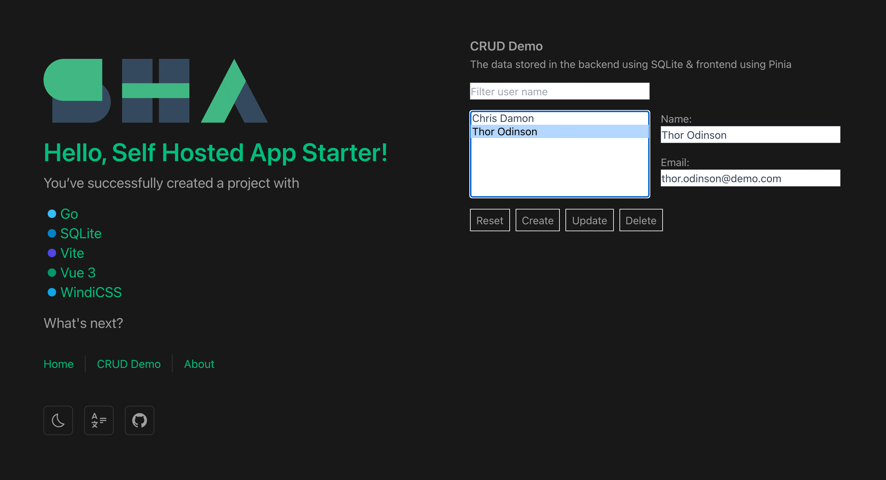

<p align="center">
  <a href="https://github.com/xiaoluoboding/self-hosted-app-starter">
    
  </a>
</p>

<h1 align="center">Self Hosted App Starter</h1>

<p align="center">A starter for the self-hosted app, help you to build your next full-stack project.</p>

<p align="center">
  <a href="https://self-hosted-app-starter.up.railway.app/">Live Demo</a> •
  <a href="https://xiaoluoboding.github.io/self-hosted-app-starter/">Documentation</a>
</p>

<p align="center">
  
  
  
</p>

## Preview



## Features

> SHA is built on top of GSVT Stack, which stands for Go、SQLite、Vue 3、TailwindCSS

- 🪄 Full-stack starter with GSVT Stack
- ⚓️ Self-hosted with `Dockerfile` on the fly
- 💾 Store your data using the SQLite database
- 🖖 Choosing your familiar Front-end Tech Stack, default is Vue 3
- 🚄 Deploy your app easily on the Railway

### Deploy Services

### ⚓️ Deploy with Docker

```docker
docker run --name sha --publish 3399:8080 --volume ~/.getsha/:/var/opt/sha -e mode=prod getsha/sha:0.1.0
```

`SHA` should now be running at http://localhost:3399.

### 🚄 Deploy on Railway

[](https://railway.app/new/template/prX7No?referralCode=UEM9NF)

## Tech Stack

### Back-end

- Go
- Air
- SQLite

### Front-end

Generate by [vue3-starter](https://github.com/xiaoluoboding/vue3-starter)

- Vue 3
- Vite
- WindiCSS

### Prerequisites

- [Go](https://golang.org/doc/install) (1.16 or later)
- [Air](https://github.com/cosmtrek/air#installation) (1.27.10 or later). This is for backend live reload.
- [pnpm](https://pnpm.io/installation)

## Setup

1. Install [Air](https://github.com/cosmtrek/air#installation).

2. Pull source.

   ```bash
   npx degit xiaoluoboding/self-hosted-app-starter my-self-hosted-app
   ```

3. Start backend using air (with live reload).

   ```bash
   pnpm run dev:be
   or
   air -c backend/scripts/.air.toml
   ```

   > Change the open file limit if you encounter "error: too many open files".

   ```bash
   ulimit -n 10240
   ```

4. Start frontend (with live reload).

   ```bash
   pnpm run dev:fe
   or
   cd frontend && pnpm i && pnpm run dev
   ```

The app should now be running at https://localhost:3000 and change either frontend or backend code would trigger live reload.

## Inspired by

[Bytebase](https://github.com/bytebase/bytebase)

## License

MIT [@xiaoluoboding](https://github.com/xiaoluoboding)
